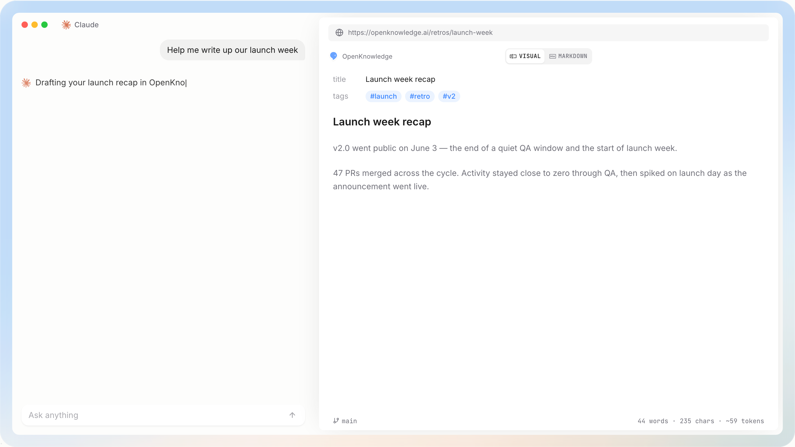

# OpenKnowledge

OpenKnowledge is a beautiful, local-first WYSIWYG markdown editor with integrations for Claude, Codex, and other harnesses. For personal notes, knowledge bases, specs, and LLM wikis.



<div align="center">
  <a href="https://github.com/inkeep/open-knowledge/releases/latest/download/OpenKnowledge-arm64.dmg">macOS app</a>
  <span>&nbsp;&nbsp;•&nbsp;&nbsp;</span>
  <a href="https://openknowledge.ai/docs/get-started/quickstart#ok-install-web-app-linux-windows-intel-mac">Web App / CLI</a>
  <span>&nbsp;&nbsp;•&nbsp;&nbsp;</span>
  <a href="https://x.com/OpenKnowledgeAI">𝕏</a>
  <span>&nbsp;&nbsp;•&nbsp;&nbsp;</span>
  <a href="https://discord.com/invite/YujKpFN49">Discord</a>
</div>

# Features

Key highlights:
- Full true **WYSIWYG** so that editing markdown files feels like editing a Google Doc or Notion page. 
- Collaborative **AI-editing** with **Claude, Codex, and Cursor desktop apps**. Can be used with any harness/agent via MCP/CLI, like OpenCode.
- Out-of-the-box **MCP**, **skills**, and **agentic search** for LLM Wikis, agent second brains, and knowledge graphs.
- No-code **Team sharing** and **Auto-sync** powered by git/GitHub under the hood.
- **Embeddable HTML** and rich components for writing engineering specs and visualized reports.
- A **built-in TUI** in the Desktop app and a Web UI for users who prefer terminals.

Docs for general usage: <https://openknowledge.ai/docs>.

## Install

**macOS:** download the desktop app — open the DMG, drag **OpenKnowledge** to **Applications**, and launch it. [Latest release](https://github.com/inkeep/open-knowledge/releases/latest).

**Linux, Windows, Intel Mac:** run the same editor as a local web app via the CLI ([Node.js 24+](https://nodejs.org) required):

```bash
npm install -g @inkeep/open-knowledge
cd your-project
ok init          # scaffold the project + wire up Claude Code, Cursor, and Codex
ok start --open  # serve the web editor and open it in your browser
```

## Contributions

Public pull requests are welcome. When a public PR opens here, automation mirrors it into the internal monorepo for review and merge. 

See [CONTRIBUTING.md](./CONTRIBUTING.md) for details.

## License

OpenKnowledge is licensed under the [GNU General Public License v3.0 or later](./LICENSE) (`GPL-3.0-or-later`).

<p align="center">
  ⭐️ If you'd like to support this project, consider starring the repo ⭐️
</p>
